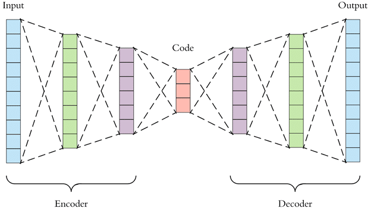

## Denoising images using autoencoders

Denoising autoencoders application is very versatile and can be focused on cleaning old stained scanned images or contribute to feature selection efforts in cancer biology.
Regarding, old images encoder compression contributes to an output, which helps model reconstructing the actual image using robust latent representations by the decoder.

## What are autoencoders?
At a high level, an autoencoder contains an encoder and decoder. These two parts function automatically and give rise to the name “autoencoder”. Encoder transforms high-dimensional input into lower-dimension (latent state, where the input is more compressed), while a decoder does the reverse encoder job on the encoded outcome and reconstructs the original image. It should be noted that traditional autoencoders (vanilla autoencoders) cannot reconstruct images from a latent state.

